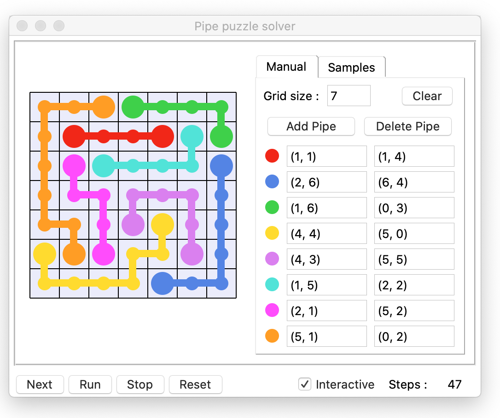
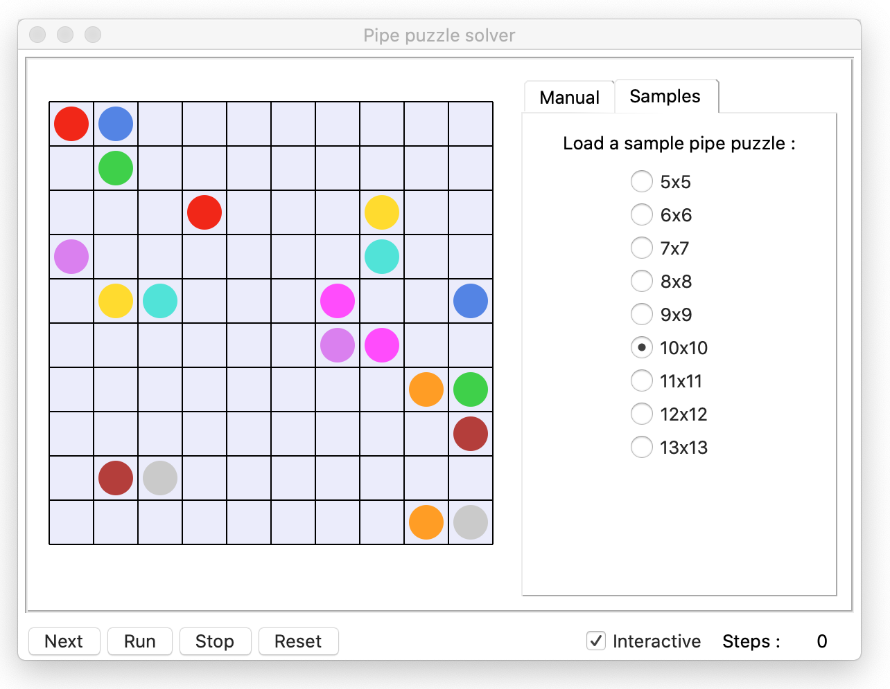

# GUI solver for the "Pipe Art" mobile game

### Pipe Art puzzles
Pipe Art puzzles consist of a square grid containing some pipes.  
Only the start cell and the end cell of each pipe are known, and the goal is to connect all pipes without crossing any pipe.

This program offers a GUI to setup such a pipe puzzle and to resolve it.

### Solver usage

The size of the grid can be defined from the GUI, and the start/end of each pipe can be positioned by clicking on the grid cells.  
Once a pipe start/end is positioned on the grid, its coordinates will appear in the right configuration panel.

---
**Note** : 
You never need to manually enter coordinates, you should always click on the grid.
To modify a pipe start/end, click on its entry in the right panel to focus it, and click on the new position in the grid.
---

### Puzzle resolution

The resolution can be performed :
 - **step by step** : show the successive moves one by one ("Next" button)
 - **interactively** : run the resolution and display every move in real-time in the GUI ("Run" button)
 - **by the engine only** : the GUI does not show all resolution moves and only displays the solution (untick the "Interactive" checkbox)

### Puzzle samples

From the _Samples_ tab, a sample puzzle of different sizes can be loaded in the grid for resolution :
 

---
**Note** : 
This program was developed to render nicely on Mac OS.  
It should run correctly on Windows as well, but the layout may be messed up due to tkinter OS-specific rendering.
---