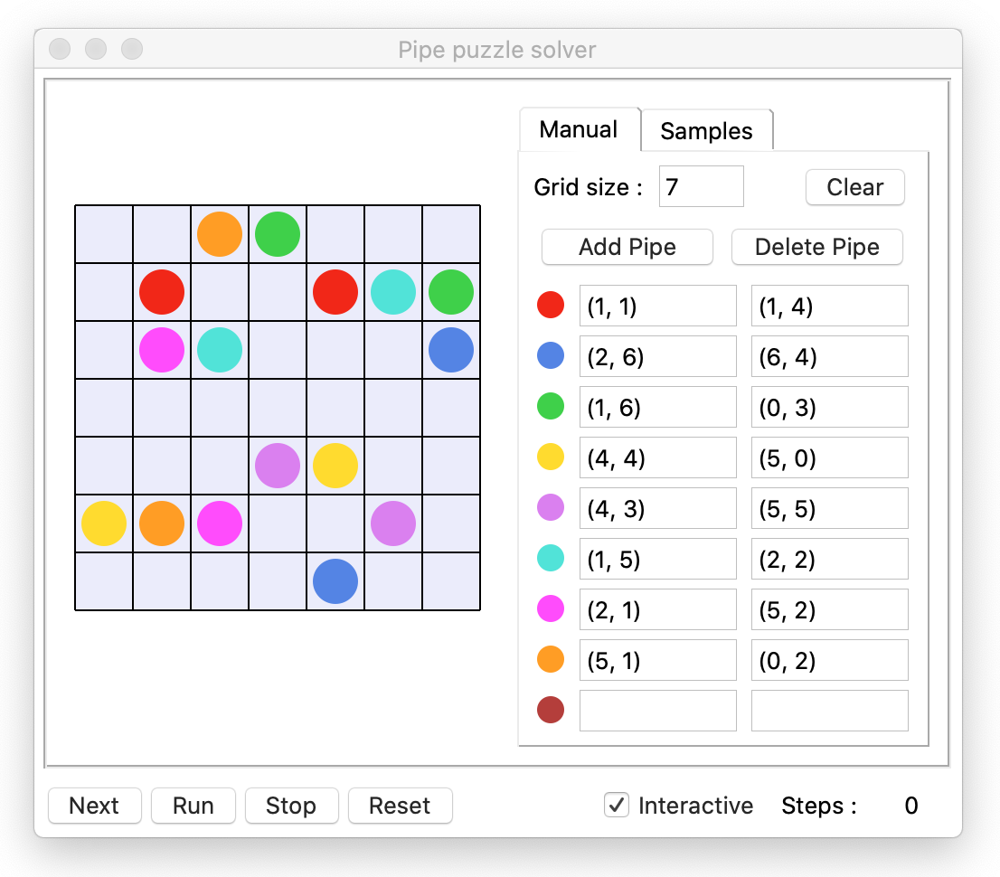

# GUI solver for the "Pipe Art" mobile game

### Pipe Art puzzles
[Pipe Art puzzles](https://play.google.com/store/apps/details?id=com.bitmango.go.linepuzzlepipeart&hl=en&gl=US) consist of a square grid containing some pipes.    
Only the start cell and the end cell of each pipe are given.  
The goal is to connect the start and the end of each pipe without crossing any other pipe.

This program offers a GUI to set up such a pipe puzzle and to resolve it.

### Solver usage

The size of the grid can be defined from the GUI, and the start/end of each pipe can be positioned by clicking on the grid cells.  
Once a pipe start/end is positioned on the grid, its coordinates will appear in the right configuration panel.

> **Note**  
>You never need to manually enter coordinates, you should always click on the grid.
>To modify a pipe start/end, click on its entry in the right panel to focus it, and click on the new position in the grid.

### Puzzle resolution

The resolution can be performed :
 - **step by step** : show the successive moves one by one ("Next" button)
 - **interactively** : run the resolution and display every move in real-time in the GUI ("Run" button)
 - **by the engine only** : the GUI does not show all resolution moves and only displays the solution (untick the "Interactive" checkbox)

### Puzzle samples

From the _Samples_ tab, a sample puzzle of different sizes can be loaded in the grid for resolution :
 

> **Note**  
>This program was developed to render nicely on Mac OS.  
>It should run correctly on Windows as well, but the layout may be messed up due to tkinter OS-specific rendering.

### Algorithm strategy

The solver uses multiple engines, which implement a specific strategy to find the path for each pipe.   
Each engine builds on the previous ones to improve the path finding strategy.

##### Brute-force engine

This is the straight-forward strategy with no optimization.  
The engine tries every possible move for each pipe.  
It is very time-consuming and is not viable for big grids, but it is used as a base by other strategies that limit the paths to process.

##### Path-checker engine

This strategy adds a check to the brute-force strategy to discards a path early when possible.  
A BFS (breadth-first search) is performed after every move to ensure that every pipe can still be connected to its other end. 
If any pipe can no longer reach its other end, the current path is discarded.
.

##### Wall-follower engine

If a pipe can be connected by following the walls, then that is guaranteed to be the correct solution, as it does not
cross any other pipe and leaves the maximum space on the grid for other pipes.

The previous strategies process pipes in the arbitrary order they are provided to the solver.  
The wall-follower strategy will improve that order selection, by processing in priority the pipes that can be connected by following the walls.  

##### Empty-cells-checker engine

This strategy brings 2 major improvements to the previous ones :

- if a pipe forms a loop, then this path is discarded, since that is guaranteed to not be optimal.

- after each move, the engine checks if there are some isolated empty cells that are no longer reachable by any remaining pipe.
  If such cells exist, then there are "holes" in the grid, so the path is discarded.

Note that this strategy assumes that the solution leaves no hole in the grid.  
If a puzzle's solution contains holes, it will be discarded by this strategy.

##### Shortest-path engine

Previous strategies share a common major flaw : they use a DFS strategy (depth-first search),
which means that if a wrong move is made at the beginning of the tested pipe, the engine will process all possible paths with this wrong move before changing it.

The shortest-path engine changes this approach to a BFS (breadth-first search), 
so for a given pipe it will process paths from the shortest to the longest, using as a distance metric
the current length of the pipe added to the Manhattan distance to the pipe end.